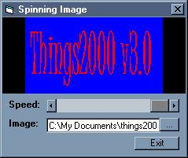



## Spinning Image Effect

### Description

this code just spins a image like a 3d object using only strechtblt. pretty simple and cool... maybe if demanded ill make a activex control for this. please vote
 
### More Info
 

             |
---                |---
**Submitted On**   |2002-06-24 21:15:48
**By**             |[poop\_4\_brains](https://github.com/Planet-Source-Code/PSCIndex/blob/master/ByAuthor/poop-4-brains.md)
**Level**          |Beginner
**User Rating**    |4.3 (17 globes from 4 users)
**Compatibility**  |VB 6\.0
**Category**       |[Graphics](https://github.com/Planet-Source-Code/PSCIndex/blob/master/ByCategory/graphics__1-46.md)
**World**          |[Visual Basic](https://github.com/Planet-Source-Code/PSCIndex/blob/master/ByWorld/visual-basic.md)
**Archive File**   |[Spinning\_I983686242002\.zip](https://github.com/Planet-Source-Code/poop-4-brains-spinning-image-effect__1-36234/archive/master.zip)

